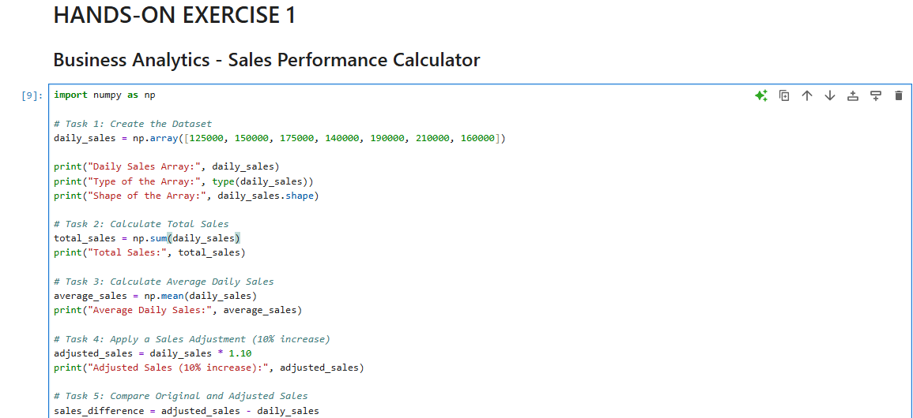
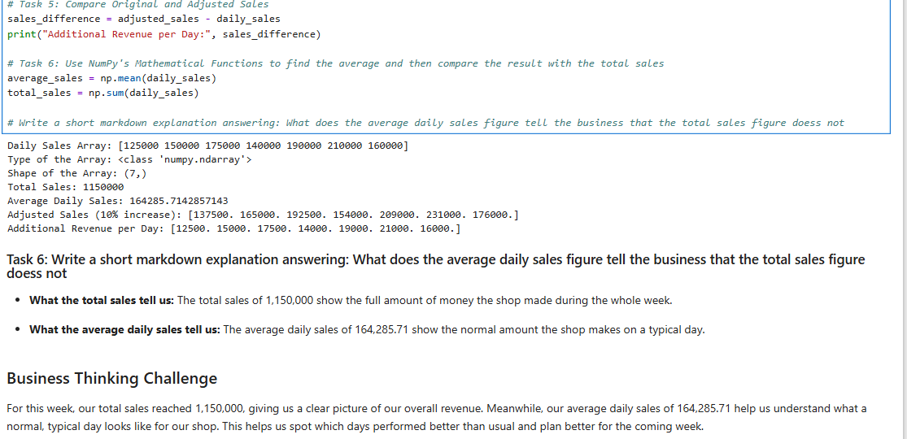
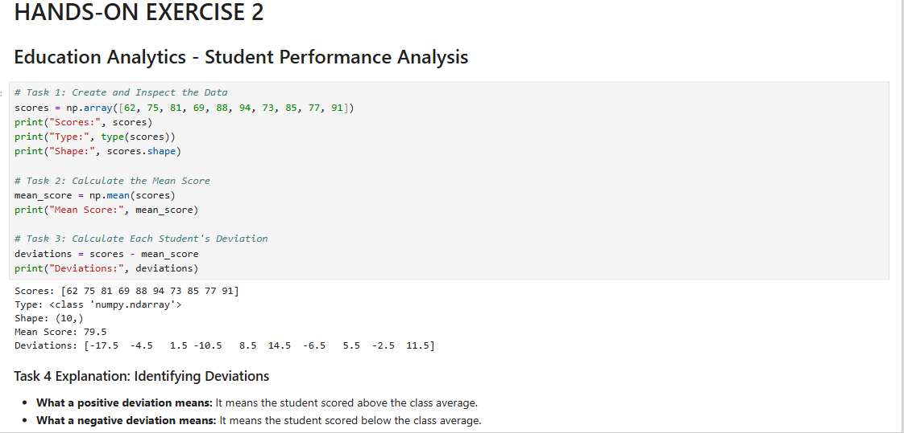
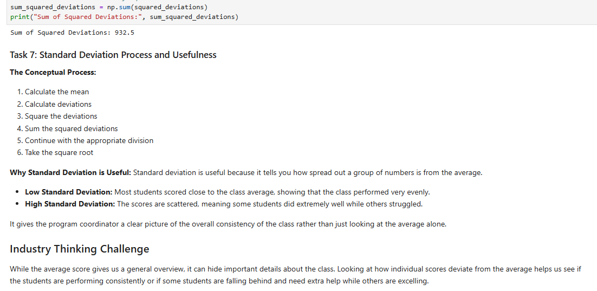
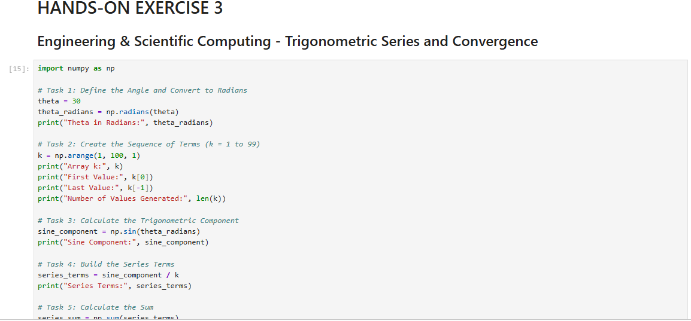
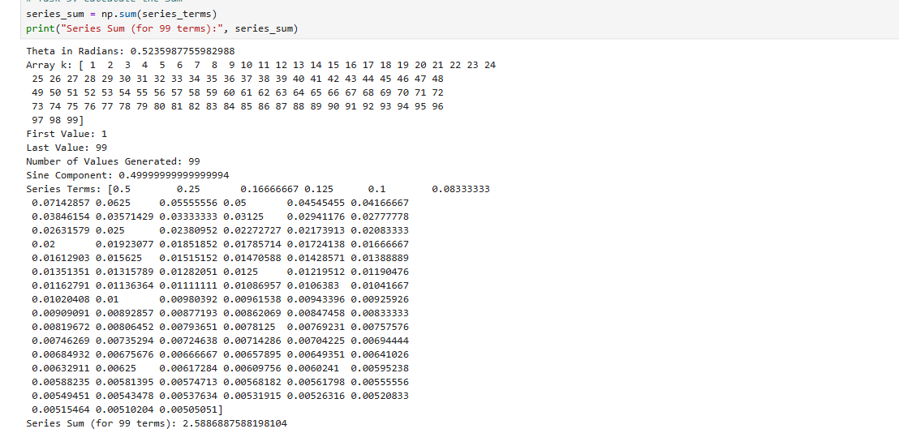
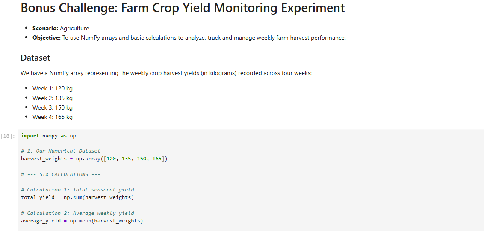
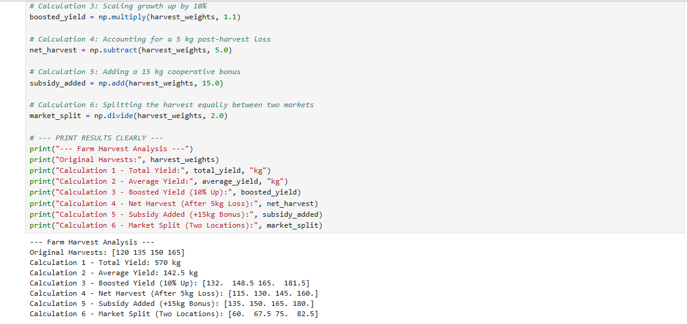

# Hands-On-15-Mathematical-Operations-Equations-and-Sequences-with-NumPy-Arrays

# NumPy Industry Application Practices

This project dives deep into the practical implementation of Numerical Python (NumPy) for solving complex, real-world challenges spanning business analytics, education, advanced scientific computing, and modern agriculture. By leveraging high-performance array-based computations, memory-efficient data structures, and vectorized execution engines, this notebook demonstrates how fundamental mathematical equations, linear algebra transformations, and sequential logic can completely transform raw numbers into strategic, actionable insights.

## Project Overview and Theoretical Foundation
Numerical Python (NumPy) serves as the undisputed foundational bedrock for all scientific computing, numerical analysis, and data science workflows within the Python ecosystem. Standard Python lists, while flexible, suffer from severe performance bottlenecks, high memory overhead, and slow iteration speeds when handling massive datasets, multi-dimensional matrices, or complex mathematical equations due to dynamic typing and pointer overhead. NumPy solves this fundamental architectural limitation by introducing the homogeneous `ndarray` (n-dimensional array) object. This core data structure allows developers, software engineers, and data analysts to execute lightning-fast vectorized operations, advanced statistical aggregations, broadcasting calculations, and mathematical transformations without writing explicit, slow Python `for` loops. 

Throughout this project, we explore how core NumPy functions streamline everyday calculations across diverse industries. Whether we are projecting multi-store retail revenue expansions, evaluating student examination score variances, computing intricate trigonometric convergence series, or monitoring agricultural crop yield distributions, every single exercise contained within this workspace bridges theoretical mathematical principles with practical, domain-specific problem-solving. Furthermore, this documentation incorporates structured placeholders for code implementation screenshots, allowing developers to visually audit, verify, and cross-reference their programmatic outputs directly against our documented benchmarks and analytical findings.

---

## Comprehensive Breakdown of Hands-On Exercises

### Exercise 1: Business Analytics - Sales Performance Calculator and Revenue Forecasting
In the modern business landscape, tracking micro-level revenue trends, evaluating daily cash flows, and projecting macro-level future growth are absolute prerequisites for strategic decision-making and sustainable enterprise management. This exercise utilizes 1D numerical arrays to ingest daily store sales data, evaluate core financial performance metrics, and simulate future fiscal expansions.

* **Dataset Initialization and Vector Construction:** We construct a 1D NumPy array representing daily retail store revenues over a complete weekly operational cycle using explicit array instantiation: `daily_sales = np.array([125000, 150000, 175000, 140000, 190000, 210000, 160000])`. This structure stores our financial metrics consecutively in contiguous memory blocks for ultra-fast CPU retrieval.
* **Array Structure Inspection and Metadata Verification:** We evaluate the underlying data type using `type(daily_sales)` to verify the `numpy.ndarray` classification, and inspect the structural dimensions using `daily_sales.shape` to confirm our dataset contains exactly seven elements representing a standard seven-day operating week.
* **Total Weekly Revenue Calculation:** By applying the aggregation function `np.sum(daily_sales)`, we compute the cumulative financial turnover across the entire week, yielding a total aggregate revenue sum of $1,150,000$. This metric provides executives with an immediate macro-level evaluation of enterprise health.
* **Average Daily Sales Baseline Evaluation:** Using the central tendency function `np.mean(daily_sales)`, we calculate the normal daily sales baseline, which evaluates to approximately $164,285.71$. This metric establishes a reliable benchmark for store managers to assess individual day performance against typical operating standards.
* **Growth Projection, Scaling, and Array Broadcasting:** We simulate a strategic 10% business expansion and seasonal market growth by multiplying our entire array by a scalar factor (`daily_sales * 1.10`), instantly generating adjusted sales forecasts for the upcoming trading season without manual iteration.
* **Incremental Performance Delta Comparison:** By subtracting the original revenue array from our newly scaled projection array (`adjusted_sales - daily_sales`), we isolate the exact additional revenue generated per individual day under the 10% growth scenario, mapping out precise financial gains.
* **Strategic Business Insights:** Total sales figures reveal the overarching financial velocity of the storefront across the week, while average daily sales provide the granular baseline required for optimal inventory stocking, supply chain replenishment, and staff scheduling.

---

---

### Exercise 2: Education Analytics - Student Performance Evaluation & Standard Deviation
Understanding how academic cohorts perform collectively and how individual learners score relative to the group helps program coordinators, institutional administrators, and educators evaluate instructional effectiveness, grading fairness, and class consistency.

* **Dataset Initialization:** We store student examination scores in a dedicated NumPy array container representing a representative classroom cohort: `scores = np.array([62, 75, 81, 69, 88, 94, 73, 85, 77, 91])`.
* **Mean Score Evaluation:** We compute the central academic tendency of the class using `np.mean(scores)`, which calculates the arithmetic mean resulting in an exact class average score of $79.5$.
* **Individual Score Deviations:** To measure the precise distance and dispersion of each student's score away from the class average, we execute vector subtraction (`scores - mean_score`), generating an array of signed deviation values such as `[-17.5, -4.5, 1.5, ...]` that highlight outperforming and underperforming students.
* **Squaring Deviations for Variance Analysis:** To prevent negative and positive deviations from canceling each other out during summation, we square every individual deviation value (`deviations ** 2`), mathematically transforming all spread metrics into positive numbers.
* **Sum of Squared Deviations Aggregation:** Using `np.sum(squared_deviations)`, we accumulate the total squared dispersion across the entire academic cohort, resulting in a total sum of squares equal to $932.5$.
* **Comprehensive Understanding of Standard Deviation:** Standard deviation measures the absolute spread and variability of a dataset around its central average. A low standard deviation indicates that students clustered tightly around the class average, demonstrating uniform teaching comprehension, whereas a high standard deviation indicates scattered academic performance where some students excelled while others required immediate educational intervention.

---

### Exercise 3: Engineering & Scientific Computing - Trigonometric Series and Convergence
Scientific computing, mechanical modeling, and advanced engineering simulations frequently require formulating mathematical equations, converting angular measurements between units, and analyzing the convergence limits of infinite mathematical series.

* **Angular Conversion and Radian Preparation:** We define a standard geometric angle in degrees ($\theta = 30^\circ$) and convert it into standard mathematical radians using `np.radians(theta)` to prepare the value for subsequent trigonometric computations.
* **Systematic Sequence Generation:** Using `np.arange(1, 100, 1)`, we generate an array of sequential numerical terms ($k$ ranging from $1$ to $99$) to build structured mathematical series and polynomial approximations.
* **Trigonometric Component Evaluation:** We compute the sine wave component of our converted radian angle using `np.sin(theta_radians)`, establishing a constant trigonometric multiplier for our series expansion.
* **Series Term Construction:** We construct our series elements by dividing the trigonometric sine component by each sequential array value (`sine_component / k`), generating a complete vector of fractional series terms.
* **Summation and Convergence Limit Testing:** Using `np.sum(series_terms)`, we calculate the cumulative sum of the series. By expanding our term generation thresholds across larger operational scales ($99$ terms yielding $2.588$, $999$ terms yielding $3.742$, and $9,999$ terms yielding $4.893$), we rigorously investigate how mathematical series behave as they approach asymptotic limits.
* **Advanced Mathematical Takeaway:** Observing how numerical outputs evolve as term counts increase helps engineers, physicists, and data modelers understand the stability, numerical precision, and computational predictability of algorithms when processing massive scientific data streams.

---

### Exercise 4: Agricultural Analytics - Farm Crop Yield Monitoring Experiment
Applying array broadcasting, vector arithmetic, and statistical aggregation to agricultural operations helps farm managers, agronomists, and supply chain coordinators track seasonal harvests, account for post-harvest loss, and plan regional food logistics efficiently.

* **Numerical Dataset Initialization:** We record weekly crop harvest weights (measured in kilograms) across a structured four-week agricultural monitoring cycle: Week 1 ($120\text{ kg}$), Week 2 ($135\text{ kg}$), Week 3 ($150\text{ kg}$), and Week 4 ($165\text{ kg}$).
* **Calculation 1 (Total Seasonal Yield):** By executing `np.sum(harvest_weights)`, we aggregate all weekly harvest weights together, achieving a total cumulative production output of $570\text{ kg}$ across the four-week monitoring window.
* **Calculation 2 (Average Weekly Yield Baseline):** Using `np.mean(harvest_weights)`, we calculate the average agricultural output across the month, arriving at $142.5\text{ kg}$ per week to establish a dependable baseline for normal productivity.
* **Calculation 3 (Growth Projection - 10% Increase):** Using `np.multiply(harvest_weights, 1.1)`, we scale each week's harvest up by 10% to project production output under optimized irrigation and fertilizer conditions (`[132., 148.5, 165., 181.5]`).
* **Calculation 4 (Waste Adjustment - 5 kg Deduction):** Using `np.subtract(harvest_weights, 5.0)`, we deduct $5\text{ kg}$ from each week's record to account for normal post-harvest losses, transit damage, or storage spoilage (`[115., 130., 145., 160.]`).
* **Calculation 5 (Bonus Subsidy - 15 kg Increment):** Using `np.add(harvest_weights, 15.0)`, we simulate an extra governmental supply boost or organic fertilizer subsidy granted to farmers, increasing each week's recorded yield by $15\text{ kg}$ (`[135., 150., 165., 180.]`).
* **Calculation 6 (Market Distribution - Split Two Ways):** Using `np.divide(harvest_weights, 2.0)`, we split each week's total crop weight evenly into two equal parts to assist logistics planners in distributing food stock equally between two separate regional sales markets (`[60., 67.5, 75., 82.5]`).

---

## Technical Summary and Core Functions Used
This repository relies extensively on core NumPy capabilities to achieve high-performance data manipulation and numerical execution:
* `np.array()`: Initializes contiguous multi-dimensional numerical containers optimized for CPU cache efficiency.
* `np.sum()`: Aggregates array elements across specified axes to compute cumulative totals.
* `np.mean()`: Computes mathematical averages and central tendencies for statistical data profiling.
* `np.multiply()` / `*`: Performs element-wise scaling, expansion, and growth projections.
* `np.subtract()` / `-`: Handles waste deductions, loss adjustments, and negative variance evaluations.
* `np.add()` / `+`: Applies subsidies, bonuses, and positive incremental adjustments.
* `np.divide()` / `/`: Distributes quantities evenly across partitions for logistical planning.
* `np.radians()`: Converts angular degrees into standard radian format for trigonometric evaluations.
* `np.arange()`: Generates systematic, evenly-spaced numerical sequences for mathematical series.
* `np.sin()`: Computes trigonometric sine wave components for advanced scientific modeling.

---

## Conclusion and Final Remarks

Through these diverse, hands-on exercises, this project successfully demonstrates how vectorizing calculations with core NumPy tools (`np.array`, `np.sum`, `np.mean`, `np.multiply`, `np.subtract`, `np.add`, and `np.divide`) makes tracking, analyzing, modeling, and planning real-world operations exceptionally fast, clean, memory-efficient, and mathematically robust. Whether optimizing a multi-store retail business, evaluating academic test scores, modeling infinite mathematical series, or managing agricultural harvests, NumPy provides the core computational engine required for modern data science. Thank you for exploring this repository; feel free to star, fork, or clone this project for your own professional data portfolio!

---

## Author
Muhyideen Saadah Aduke
